# Trading Intelligence Orchestrator - Rust-Centric Architecture

## Executive Summary

The Trading Intelligence Orchestrator is a cross-platform trading application built with Rust for all client interfaces (mobile, desktop, web) and backend services, with Python handling AI/ML orchestration and MCP servers. The system provides real-time trading insights by combining live market data, technical analysis, and AI-powered recommendations.

## Simplified System Architecture

```mermaid
graph TB
    subgraph "Rust Client Layer"
        DIOXUS["Dioxus Framework<br/>📱 Mobile | 💻 Desktop | 🌐 Web<br/>Single Rust Codebase"]
    end
    
    subgraph "Rust Backend Services"
        API["API Gateway<br/>Axum + WebSocket"]
        AUTH["Authentication<br/>JWT + Rate Limiting"]
    end
    
    subgraph "Python AI/ML Layer"
        ORCH["Orchestrator<br/>FastAPI"]
        MCP_MARKET["Market Data MCP"]
        MCP_ANALYSIS["Analysis MCP"]
        MCP_SENTIMENT["Sentiment MCP"]
        LLM["LLM Service<br/>Ollama/OpenAI"]
    end
    
    subgraph "Data Layer"
        MARKET_APIS["Market APIs<br/>Alpha Vantage, Twelve Data"]
        NEWS_APIS["News APIs<br/>NewsAPI, Reddit"]
        VDB["ChromaDB<br/>Vector Patterns"]
        TSDB["InfluxDB<br/>Time Series"]
        CACHE["Redis<br/>Real-time Cache"]
    end
    
    DIOXUS <--> API
    API <--> AUTH
    API <--> ORCH
    
    ORCH <--> MCP_MARKET
    ORCH <--> MCP_ANALYSIS
    ORCH <--> MCP_SENTIMENT
    ORCH <--> LLM
    
    MCP_MARKET <--> MARKET_APIS
    MCP_SENTIMENT <--> NEWS_APIS
    
    MCP_MARKET <--> TSDB
    MCP_ANALYSIS <--> VDB
    MCP_SENTIMENT <--> CACHE
```



## Technology Stack Overview

### Rust Components
| Component | Framework/Crate | Purpose |
|-----------|----------------|---------|
| **Cross-Platform UI** | Dioxus | Single codebase for mobile, desktop, web |
| **API Gateway** | Axum | High-performance HTTP/WebSocket server |
| **Authentication** | JWT + Custom | Security and rate limiting |
| **Real-time Communication** | Tokio-tungstenite | WebSocket connections |
| **Database Drivers** | SQLx, Redis-rs | Database connectivity |

### Python Components
| Component | Framework/Library | Purpose |
|-----------|------------------|---------|
| **Orchestrator** | FastAPI | AI/ML workflow coordination |
| **MCP Servers** | Custom Python | Specialized data processing |
| **LLM Integration** | Ollama/OpenAI API | AI-powered analysis |
| **Technical Analysis** | TA-Lib, NumPy | Financial indicators |
| **Sentiment Analysis** | Transformers, NLTK | News/social sentiment |

### Data Storage
| Database | Purpose | Retention |
|----------|---------|-----------|
| **ChromaDB** | Vector similarity search for trading patterns | 1 year |
| **InfluxDB** | Time series market data (OHLCV) | 90 days |
| **Redis** | Real-time caching and session management | 24 hours |
| **SQLite** | Local configuration and user preferences | Permanent |

## Rust Framework Choice: Dioxus

### Why Dioxus for Cross-Platform Trading Application

**Dioxus** is the optimal choice for this trading application because:

#### True Single Codebase Benefits
- **One UI Logic**: Write trading interface once, deploy everywhere
- **Consistent UX**: Identical user experience across web, desktop, and mobile
- **Shared State Management**: Real-time trading data synchronization across all devices
- **Unified Testing**: Single comprehensive test suite for all platforms
- **Single Development Workflow**: One build system, one set of dependencies

#### Platform Deployment Options
- **Web**: Compiles to WebAssembly for browser deployment
- **Desktop**: Native applications for macOS, Windows, Linux via WebView
- **Mobile**: iOS and Android apps with native performance
- **Server**: Server-side rendering capabilities for SEO/performance

#### Trading-Specific Advantages
- **Real-time Performance**: Rust's zero-cost abstractions for live market data
- **Memory Safety**: Critical for financial applications handling sensitive data
- **Concurrent Processing**: Handle multiple market feeds simultaneously without data races
- **Hot State Reload**: Preserve application state during development for faster iteration
- **Native Performance**: Smooth real-time charts and data updates across platforms

#### Why Dioxus Over Alternatives
| Framework | Single Codebase | Cross-Platform | Performance | Maturity | Trading Suitability |
|-----------|-----------------|----------------|-------------|----------|-------------------|
| **Dioxus** | ✅ True single codebase | ✅ Web/Desktop/Mobile | ✅ High | 🟡 Growing fast | ✅ **Excellent** |
| **Leptos + Tauri** | ❌ Two codebases | 🟡 Web/Desktop only | ✅ Highest | ✅ Mature | 🟡 Good but limited |
| **Flutter + Rust** | ❌ Two codebases | ✅ All platforms | 🟡 Good | ✅ Very mature | 🟡 Good but complex |
| **Yew** | ✅ Single codebase | ❌ Web only | ✅ High | ✅ Mature | ❌ Limited scope |

#### Development Decision Factors
**Chosen Dioxus because:**
1. **Simplicity**: One codebase to maintain instead of separate web/desktop/mobile projects
2. **Consistency**: Identical behavior across all platforms crucial for trading applications
3. **Development Speed**: Faster iteration with shared components and state management
4. **Future-Proof**: Active development with strong community support (20k+ stars)
5. **Trading Focus**: Real-time data handling capabilities essential for market applications

## Component Architecture Deep Dive

### Client Layer (Rust - Dioxus)

#### Application Structure
```
Trading App (Dioxus)
├── Dashboard View
│   ├── Market Overview
│   ├── Watchlist
│   └── Real-time Charts
├── Analysis View
│   ├── Technical Indicators
│   ├── AI Insights
│   └── Pattern Recognition
├── Portfolio View
│   ├── Positions
│   ├── P&L Tracking
│   └── Risk Management
└── Settings View
    ├── API Configuration
    ├── Notifications
    └── Preferences
```

#### Cross-Platform Deployment Strategy
1. **Web Deployment**: `dx serve --platform web` for browser access
2. **Desktop Deployment**: `dx bundle --platform desktop` for native apps
3. **Mobile Deployment**: `dx serve --platform android/ios` for mobile apps
4. **Shared State**: Global state management across all platforms
5. **Offline Support**: Local SQLite cache for offline functionality

#### Real-time Data Flow
1. **WebSocket Connection**: Persistent connection to Rust API Gateway
2. **State Management**: Dioxus global state for market data synchronization
3. **Reactive UI Updates**: Components automatically update on data changes
4. **Cross-Platform Sync**: State synchronized across web, desktop, and mobile
5. **Hot State Reload**: Development state preserved across code changes

### Backend Services (Rust)

#### API Gateway Responsibilities
- **Request Routing**: Direct trading queries to appropriate services
- **WebSocket Management**: Handle real-time market data streams
- **Authentication**: JWT token validation and user session management
- **Rate Limiting**: Protect against API abuse and ensure fair usage
- **Response Caching**: Cache frequent queries for performance

#### Security Features
- **CORS Configuration**: Secure cross-origin requests
- **API Key Management**: Secure storage of external API credentials
- **Request Validation**: Input sanitization and validation
- **Audit Logging**: Track all trading-related requests

### Python AI/ML Layer

#### Orchestrator Role
The Python orchestrator acts as the "brain" of the system:
- **Query Processing**: Parse and understand trading requests
- **Context Assembly**: Gather relevant data from multiple MCP servers
- **AI Coordination**: Manage LLM interactions and prompt engineering
- **Response Formatting**: Structure insights for client consumption

#### MCP Server Specialization

**Market Data MCP**
- Real-time price feeds from multiple sources
- Historical data aggregation and normalization
- Economic calendar integration
- Data quality validation and error handling

**Analysis MCP**
- Technical indicator calculations (RSI, MACD, Bollinger Bands)
- Chart pattern recognition
- Machine learning model predictions
- Historical pattern similarity matching

**Sentiment MCP**
- News article sentiment analysis
- Social media sentiment tracking
- Economic announcement impact assessment
- Sentiment trend analysis and scoring

#### LLM Integration Strategy
- **Local First**: Ollama for privacy and cost control
- **Cloud Fallback**: OpenAI/Anthropic for complex analysis
- **Context Optimization**: Structured prompts with relevant data
- **Response Validation**: Verify AI recommendations against market rules

## Data Flow Architecture

### Real-time Market Data Pipeline


### Trading Analysis Request Flow


## Deployment Architecture

### Development Environment (MacBook)
```
Local Development Stack
├── Rust Services
│   ├── API Gateway (localhost:8000)
│   └── Dioxus Dev Server (localhost:3000)
├── Python Services
│   ├── Orchestrator (localhost:8001)
│   └── MCP Servers (localhost:8002-8004)
├── Databases (Docker Compose)
│   ├── ChromaDB (localhost:8005)
│   ├── InfluxDB (localhost:8086)
│   └── Redis (localhost:6379)
└── External APIs
    ├── Alpha Vantage
    ├── Twelve Data
    └── News APIs
```

### Production Deployment Options

#### Single Server Deployment
- **Cost Effective**: All services on one server
- **Simple Management**: Single deployment target
- **Suitable For**: Individual traders, small teams

#### Microservices Deployment
- **Scalable**: Independent scaling of components
- **Resilient**: Service isolation and fault tolerance
- **Suitable For**: Trading firms, multiple users

#### Hybrid Cloud Deployment
- **Flexible**: Mix of cloud and on-premise
- **Data Control**: Sensitive data on-premise
- **Suitable For**: Regulated trading environments

## Performance Characteristics

### Expected Performance Metrics
| Metric | Target | Rationale |
|--------|--------|-----------|
| **API Response Time** | < 100ms | Real-time trading requirements |
| **WebSocket Latency** | < 50ms | Live market data updates |
| **Memory Usage** | < 512MB | Efficient resource utilization |
| **CPU Usage** | < 30% | Leave resources for analysis |
| **Storage Growth** | < 1GB/month | Manageable data retention |

### Scalability Considerations
- **Horizontal Scaling**: Add more MCP servers for different markets
- **Vertical Scaling**: Increase memory/CPU for larger datasets
- **Caching Strategy**: Multi-level caching for frequently accessed data
- **Database Sharding**: Partition data by time or symbol

## Security Architecture

### Data Protection
- **Encryption at Rest**: All databases encrypted
- **Encryption in Transit**: TLS for all communications
- **API Key Security**: Secure vault for external API credentials
- **User Data Privacy**: Minimal data collection, local storage priority

### Access Control
- **Authentication**: JWT tokens with refresh mechanism
- **Authorization**: Role-based access to trading features
- **Rate Limiting**: Prevent API abuse and ensure fair usage
- **Audit Trail**: Complete logging of all trading activities

## Integration Points

### External Market Data Sources
- **Primary**: Alpha Vantage (stocks, forex, crypto)
- **Secondary**: Twelve Data (real-time quotes)
- **Economic**: FRED API (economic indicators)
- **News**: NewsAPI, Reddit API (sentiment sources)

### Future Extension Points
- **Broker Integration**: Interactive Brokers, TD Ameritrade APIs
- **Additional Markets**: Commodities, options, futures
- **Advanced Analytics**: Options flow, unusual activity detection
- **Social Trading**: Copy trading, signal sharing
- **Portfolio Management**: Multi-account aggregation

## Risk Management Framework

### Technical Risks
- **API Rate Limits**: Graceful degradation when limits exceeded
- **Data Quality**: Validation and anomaly detection
- **System Reliability**: Health checks and automatic recovery
- **Performance Degradation**: Monitoring and alerting

### Financial Risks
- **Market Data Accuracy**: Multiple source validation
- **Analysis Reliability**: Confidence scores and uncertainty quantification
- **User Education**: Clear disclaimers about AI recommendations
- **Compliance**: Adherence to financial regulations

## Success Metrics

### Technical KPIs
- **System Uptime**: 99.9% availability target
- **Response Times**: Sub-100ms for all queries
- **Data Freshness**: Market data less than 1 second old
- **Error Rates**: Less than 0.1% of requests fail

### User Experience KPIs
- **Analysis Accuracy**: Track prediction success rates
- **User Engagement**: Daily active usage metrics
- **Feature Adoption**: Usage of different analysis tools
- **User Satisfaction**: Regular feedback and surveys

## Development Roadmap

### Phase 1: Foundation (Weeks 1-4)
- Rust API Gateway with WebSocket support
- Python Orchestrator with basic MCP servers
- Dioxus client with market data display
- Local database setup and data ingestion

### Phase 2: Core Features (Weeks 5-8)
- Technical analysis integration
- AI-powered insights via LLM
- Real-time market updates
- Basic portfolio tracking

### Phase 3: Advanced Features (Weeks 9-12)
- Sentiment analysis integration
- Pattern recognition and similarity matching
- Mobile app optimization
- Performance optimization

### Phase 4: Production Ready (Weeks 13-16)
- Security hardening and testing
- Production deployment setup
- User onboarding and documentation
- Beta testing and feedback integration

This architecture provides a solid foundation for building a comprehensive, cross-platform trading intelligence system using Rust's performance and safety benefits while leveraging Python's AI/ML ecosystem for intelligent analysis.